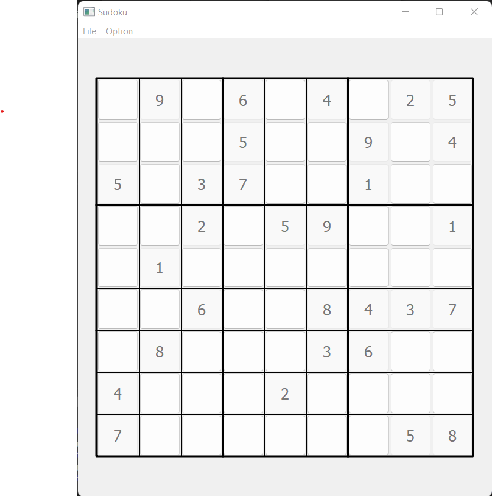

# Sudoku

A simple sudoku puzzle written in python.



## Install and run

Python 3.10 is used, though other 3.* versions should work fine.

```
python -m venv venv
pip install -r requirements.txt
python sudoku_gui.py
```

## Testing

In the project folder (venv activated), simply run:

```
pytest
```

## TODOs
- Generation of easy/medium/hard puzzles
- 4x4 proper implementatuin